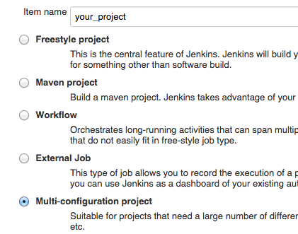
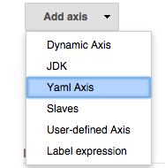
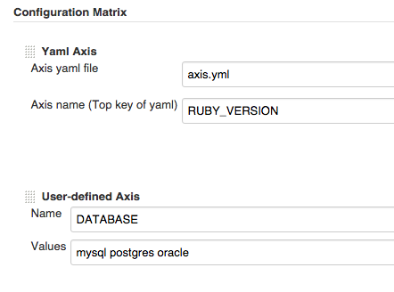
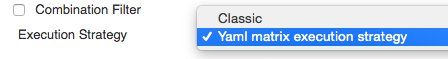
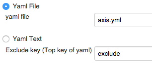
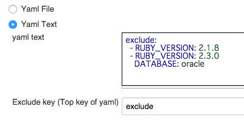
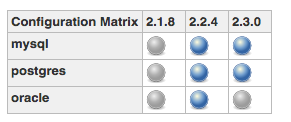

# Jenkins Yaml Axis Plugin
Matrix project axis creation plugin using yaml file

[](https://wiki.jenkins-ci.org/display/JENKINS/Yaml+Axis+Plugin)
[](https://jenkins.ci.cloudbees.com/job/plugins/job/yaml-axis-plugin/)

* https://wiki.jenkins-ci.org/display/JENKINS/Yaml+Axis+Plugin
* https://github.com/jenkinsci/yaml-axis-plugin

## Usage
### 1. Add yaml file to repository
example

```yaml
# axis.yml
RUBY_VERSION:
  - 2.1.8
  - 2.2.4
  - 2.3.0

exclude:
  - RUBY_VERSION: 2.1.8
  - RUBY_VERSION: 2.3.0
    DATABASE: oracle
```

### 2. Create Multi-configuration project


### 3. Configuration Axis
Choose **Yaml Axis**



Input configurations



* **Axis yaml file** : Yaml file path (relative path from workspace or absolute path)
* **Axis name** : Top key in yaml file

You can combine **Yaml Axis** and other axes

### 4. Configuration Execution Strategy
#### Choose "Yaml matrix execution strategy" at Execution Strategy


If you don't want to exclusion, choose **Classic**

#### Input settings
##### Example 1 (Use yaml file)



##### Example 2 (Use yaml text)


### 4. Build job
Generate yaml based matrix and run job :muscle:



## Detail
### Excluding logic
Excluding pattern may be specified with `List` of `Map` (e.g. `List<Map<String, String>>`)

```yaml
# axis.yml
exclude:
  - RUBY_VERSION: 2.1.8
  - RUBY_VERSION: 2.3.0
    DATABASE: oracle
```

When specified 2 axes


This results in a 3x3 build matrix.


* When specified `RUBY_VERSION` value `2.1.8`, 3 results are excluded
  * `RUBY_VERSION` value `2.1.8` and `DATABASE` value `mysql` is excluded
  * `RUBY_VERSION` value `2.1.8` and `DATABASE` value `postgres` is excluded
  * `RUBY_VERSION` value `2.1.8` and `DATABASE` value `oracle` is excluded
* When specified `RUBY_VERSION` value `2.3.0` and `DATABASE` value `oracle`, 1 result is excluded
  * `RUBY_VERSION` value `2.3.0` and `DATABASE` value `oracle` is excluded
