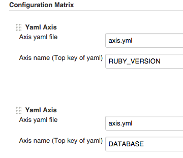
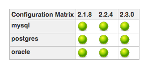

# Jenkins Yaml Axis Plugin
Matrix project axis creation plugin using yaml file

## Usage
### 1. Add yaml file to repository
example

```yaml
# axis.yml
RUBY_VERSION:
  - 2.1.8
  - 2.2.4
  - 2.3.0

DATABASE:
  - mysql
  - postgres
  - oracle
```

### 2. Create Multi-configuration project


### 3. Configuration Matrix
Choose **Yaml Axis**


Input configurations



* **Axis yaml file** : Yaml file path (relative path from workspace or absolute path)
* **Axis name** : Top key in yaml file

### 4. Build job
Generate yaml based matrix and run job :muscle:


